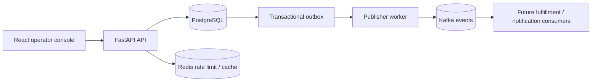

# StockFlow

### Reliable inventory reservation and order orchestration for small retailers

StockFlow is a production-style reference system for the hardest part of a simple checkout flow: making sure two concurrent customers cannot reserve the same unit. It combines transactional inventory updates, idempotent commands, a transactional outbox, Redis rate limiting, Kafka event publication, structured logs, Prometheus metrics, and a small operator console.

The project is deliberately built around a real operational problem rather than a CRUD-only demo. It is a strong portfolio project for backend, platform, and distributed-systems interviews because every major design choice is tied to a failure mode.

## Why this project exists

Retailers lose revenue and customer trust when inventory is oversold, retries create duplicate orders, or an event is written to a database but never reaches downstream systems. StockFlow handles those cases with an explicit consistency boundary:

1. The order command locks each product row and reserves inventory in the same database transaction as the order.
2. The same transaction writes an outbox event.
3. A background publisher retries outbox events to Kafka until they are acknowledged.
4. Consumers can safely process events using the event ID as their deduplication key.

## Architecture



The API is a modular monolith on purpose. Inventory and order creation share a strict transaction today, while the outbox and event contracts create clean extraction seams for future services. This keeps the correctness boundary simple without pretending that every feature needs a network hop.

See [docs/architecture.md](docs/architecture.md) for the full design, sequence diagrams, data model, invariants, and failure-mode analysis.

## Features

- Inventory catalog with available and reserved quantities.
- Atomic order creation across multiple SKUs.
- Row-level locking in PostgreSQL to prevent overselling.
- Idempotency via the `Idempotency-Key` request header.
- Cancellation that releases reservations exactly once.
- Transactional outbox for reliable asynchronous event delivery.
- Kafka publisher with retries and `acks=all` / idempotent producer settings.
- Redis-backed fixed-window rate limiting with a safe local fallback.
- Structured JSON logs and Prometheus request/order metrics.
- OpenAPI documentation at `/docs` and `/redoc`.
- React + TypeScript operator console.
- Docker Compose environment for PostgreSQL, Redis, Kafka, API, and web UI.
- Unit tests for the most important business invariants.

## Quick start

### Option A: full stack with Docker

Requirements: Docker Desktop with Compose.

```bash
cp .env.example .env
docker compose -f infra/docker-compose.yml up --build
```

Open:

- Console: http://localhost:5173
- API docs: http://localhost:8000/docs
- Health: http://localhost:8000/api/v1/health
- Metrics: http://localhost:8000/api/v1/metrics

Seed the demo catalog from another terminal:

```bash
docker compose -f infra/docker-compose.yml exec api \
  python -m app.infrastructure.seed
```

### Option B: local API and UI development

```bash
make install
cp backend/.env.example backend/.env
make infra-up    # start PostgreSQL, Redis, and Kafka; keep this terminal running
```

In two more terminals:

```bash
cd backend && ../.venv/bin/uvicorn app.main:app --reload
cd frontend && npm run dev
```

If you want to run only the business logic tests, no Docker services are needed:

```bash
make test
make lint
```

## API walkthrough

Create a catalog item (the local admin key is `local-admin-key`):

```bash
curl -X POST http://localhost:8000/api/v1/products \
  -H 'Content-Type: application/json' \
  -H 'X-Admin-Api-Key: local-admin-key' \
  -d '{"sku":"HEADPHONES-001","name":"Studio Headphones","price_cents":12999,"quantity":25}'
```

Create an idempotent order:

```bash
curl -X POST http://localhost:8000/api/v1/orders \
  -H 'Content-Type: application/json' \
  -H 'Idempotency-Key: checkout-demo-0001' \
  -d '{"customer_email":"buyer@example.com","items":[{"sku":"HEADPHONES-001","quantity":2}]}'
```

Repeat the exact request with the same `Idempotency-Key`: the API returns the original order instead of reserving another two units.

## Repository map

```text
stockflow/
├── backend/
│   ├── app/
│   │   ├── api/             # HTTP routes and request/response contracts
│   │   ├── application/     # use cases and transaction orchestration
│   │   ├── domain/          # business errors and domain vocabulary
│   │   └── infrastructure/  # SQLAlchemy, Redis, Kafka, metrics, seed data
│   └── tests/               # business-invariant tests
├── frontend/                # React + TypeScript operator console
├── infra/                   # Docker Compose and Prometheus config
├── docs/                    # architecture and operations notes
└── .github/workflows/       # CI quality gates
```

## Interview discussion points

- Why is the order and inventory write kept in one transaction?
- What does the outbox solve that publishing directly to Kafka does not?
- Why is idempotency required even when the database transaction is correct?
- How would you split the modular monolith as traffic grows?
- How would you add a payment authorization saga without holding a database lock?
- What are the differences between available, reserved, and sellable inventory?
- What would you monitor for publisher lag and reservation expiry?

## Resume-ready project description

> Built StockFlow, an event-driven inventory reservation and order-orchestration platform with FastAPI, PostgreSQL, Redis, Kafka, and React; prevented duplicate checkout effects with idempotency keys, protected stock from overselling with row-level transactional locking, and guaranteed downstream event delivery through a transactional outbox with retryable publication.

## License

MIT. See [LICENSE](LICENSE).
