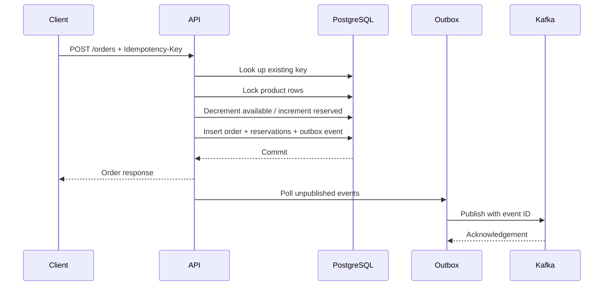

# StockFlow architecture notes

## Problem statement

Stock availability is a shared, mutable resource. A naive checkout flow reads `available_quantity`, decides that stock exists, and writes an order later. Under concurrency, two requests can both observe the same stock and create an oversell. Network retries can also repeat a command after the first attempt actually succeeded.

StockFlow makes the following invariants explicit:

- `available_quantity >= 0` at all times.
- `reserved_quantity` increases only when the corresponding order and reservation are created.
- A request with the same idempotency key has one observable order result.
- A successful order commit creates exactly one outbox record in the same database transaction.
- Cancellation releases each active reservation once.

## Command path

The database commit is the source of truth for the synchronous command. Kafka is an integration boundary, not part of the checkout transaction. If Kafka is down, the order still commits and the outbox remains pending for retry.

## Data model

| Table | Responsibility | Important constraints |
|---|---|---|
| `products` | Current inventory and catalog price | Unique `sku`; quantities are updated under row lock |
| `orders` | Customer command result | Unique `idempotency_key` |
| `order_items` | Immutable price and quantity snapshot | Unique `(order_id, product_id)` |
| `inventory_reservations` | Releaseable allocation ledger | Active rows are released on cancellation |
| `outbox_events` | Durable integration events | Unpublished rows are retried |

## Concurrency and ordering

For PostgreSQL, the service uses `SELECT ... FOR UPDATE` for each product row. When an order contains multiple SKUs, the service locks them in sorted SKU order. That deterministic order prevents two multi-item orders from waiting on each other in opposite sequences.

The current demo normalizes duplicate SKUs inside one request. This avoids creating multiple reservation rows for the same product and keeps the order item unique constraint meaningful.

## Idempotency contract

Clients generate a stable key per checkout attempt and send it in `Idempotency-Key`. The unique database constraint is the final authority. The service also performs a fast read before work. If two first attempts race, the unique constraint catches the loser, the transaction is rolled back, and the existing order is returned.

In a larger deployment, store a canonical request hash with the key. Reusing a key with a different payload should then return `409 Idempotency key reused with a different request` rather than silently returning the original result.

## Outbox and event consumers

The outbox publisher is intentionally at-least-once. A crash after Kafka acknowledges but before the database marks the row as published can publish the event twice. Downstream consumers must deduplicate by `outbox_events.id` or by an equivalent event key. Exactly-once behavior is not assumed at the integration boundary.

Events currently published:

- `order.confirmed`
- `order.cancelled`

The event envelope leaves room for `event_version`, `trace_id`, and schema registry metadata as the system evolves.

## Failure-mode analysis

| Failure | User-visible behavior | Recovery |
|---|---|---|
| Product does not exist | `404` | Correct the SKU |
| Inventory is insufficient | `409` and no order persists | Retry with a smaller quantity or later |
| Client retries successful checkout | Same order returned | Idempotency key |
| Redis unavailable | Local process fallback rate limiter | Restore Redis; use shared Redis in production |
| Kafka unavailable | Order succeeds; event remains pending | Publisher retries after Kafka recovers |
| API process crashes after DB commit | Order remains visible | Durable PostgreSQL state |
| Cancellation repeated | `409`; stock is not released twice | Reservation status transition |

## Scaling path

1. Add an expiry worker that releases reservations after `RESERVATION_TTL_MINUTES` and emits `reservation.expired`.
2. Add a payment authorization saga. Keep the stock reservation short-lived and avoid a distributed transaction.
3. Split `catalog`, `inventory`, and `orders` only when independent scaling or team ownership justifies the operational cost.
4. Use a dedicated Redis cluster for distributed rate limiting and idempotency response caching.
5. Add consumer groups for fulfillment, notifications, analytics, and fraud checks.
6. Propagate trace IDs through HTTP, database logs, outbox rows, and Kafka headers.

## Security notes

The demo uses one admin API key for catalog writes to keep local setup small. A real deployment should use OAuth/OIDC, short-lived JWTs, role-based authorization, secret management, TLS, database least privilege, and audit logging. The UI does not store secrets; the API key is only a local-development configuration value.
